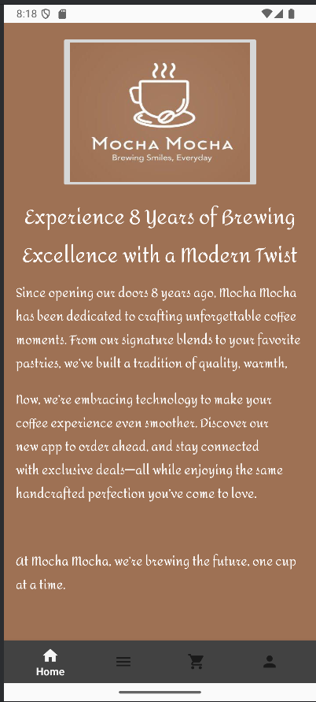
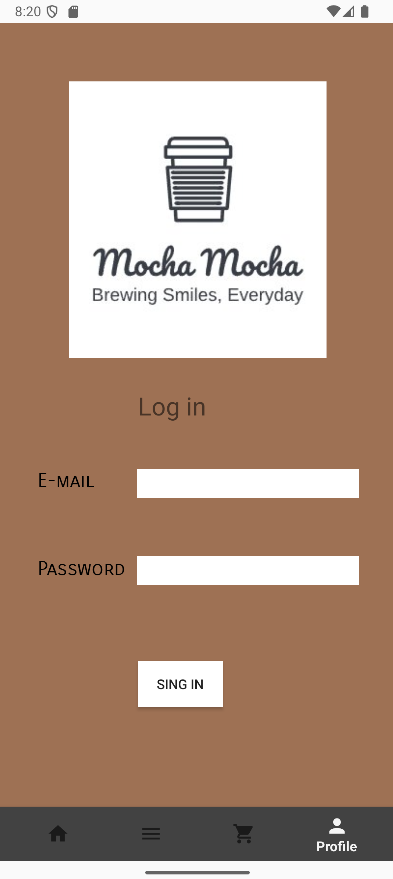
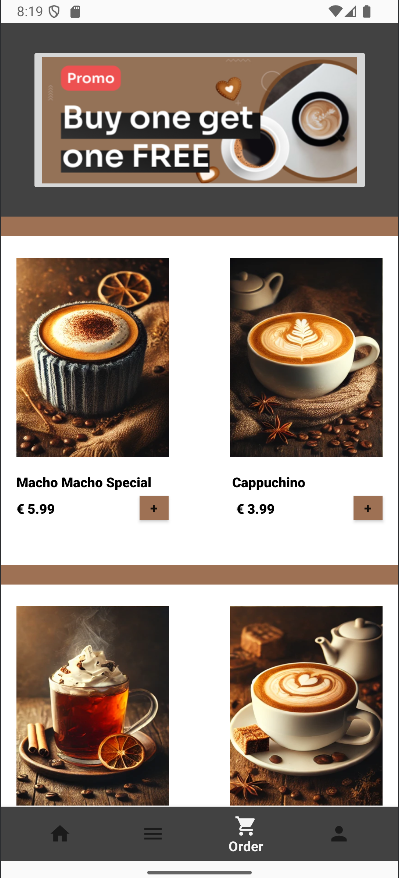
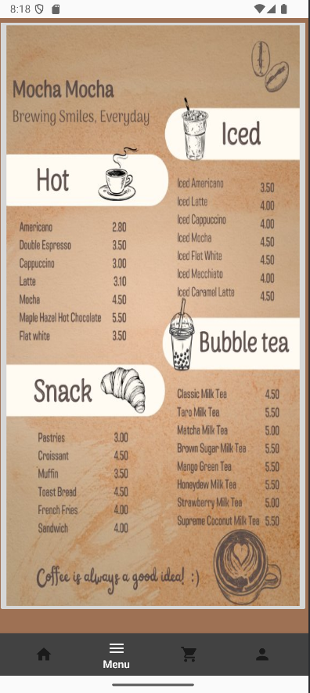

# Welcome to Mocha Coffee Shop App

A prototype Android application for a coffee shop, "Mocha Mocha," developed in Java using Android Studio. This project was created to demonstrate UI/UX design and core mobile development concepts for a work experience presentation.

**Live Demo:** Coming Soon
 [Presentation](https://drive.google.com/file/d/1LwgyEao8kj-0QU0o3tLVEEI3B-gllNXX/view?usp=sharing).

## Example Screenshots

## Features

* **Designed** a multi-screen user interface featuring a bottom navigation bar for intuitive screen transitions.
* **Designed** a multi-screen user interface featuring a bottom navigation bar for intuitive screen transitions.
* **Developed** a prototype online ordering system where users can select items and customise their orders.
* **Built** a mock user login and registration screen to demonstrate a complete user authentication flow.

## Tech Stack

* **Language:** Java
* **Platform:** Android SDK
* **UI Layouts:** XML
* **IDE:** Android Studio
* **Version Control:** Git / GitHub

## Challenges & Lessons Learned

"The primary challenge was designing and implementing a seamless multi-step ordering process within the Android activity lifecycle. 
This involved managing the state of a user's order as they navigated between the menu, item customisation, and final order screens. 
I learned to use Intent objects to effectively pass data between activities, ensuring a smooth and logical user experience from product selection to checkout."
